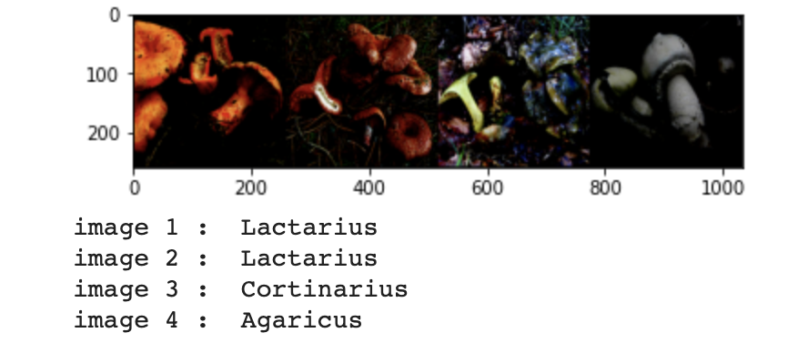

# Mushroom Genus Classification
- Contributor: Zhifu(Gary) Liu, Kelvin Fang

  

## Overview:
  
  The purpose of this project is to classify mushrooms into their corresponding genus based on their images. With the dataset consists of images from nine commonly found genera of mushrooms, we trained two models that could distinguish mushrooms.
  
## Problem setup & Data used:
- The data that are used to train the models is collected by [CatoDogo from Kaggle][1].
  - The dataset consists of `6714` images from `9` commonly found Mushroom genera in Northern Europe:
    - `Agaricus`, `Amanita`, `Boletus`, `Cortinarius`, `Entoloma`, `Hygrocybe`, `Lactarius`, `Russula`, `Suillus`
  - The dataset is randomly splitted into `train_dataset` and `test_dataset`.
    - Model 1:
      - `train_dataset`: 5000 images
      - `test_dataset`: 2714 images
      - All images are:
        - normalized (μ, σ):
          - channel R, G, B: `(0.5, 0.5)`
        - resized to `256 * 256` pixels
    - Model 2:
      - `train_dataset`: 6042 images
      - `test_dataset`: 672 images
      - All images are:
        - resized to `256 * 256` pixels
        - center cropped to `224 * 224` pixels
        - normalized (μ, σ):
          - channel R: `(0.485, 0.229)`
          - channel G: `(0.456, 0.224)`
          - channel B: `(0.406, 0.225)`
  - Image examples:
    - 
          
## Model & Techniques:
- Training (batch_size: `64`):
  - Model 1:
    -  A self-trained Convolutional Neural Network with `3` convolutional layer and `2` linear layer:
      -  Activation function = `ReLU`
      -  Loss function = `Cross entropy loss`
      -  Optimizer = `Stochastic gradient descent`
      -  For each convolutional layer, the step is `Convolve -> BatchNorm -> ReLU -> MaxPool`
      -  Then two linear layers are followed to output a `1 * 9` vector where each entry is the probablity of the mushroom belongs to the corresponding genus.
      -  Output placeholder (graph/acc)
   - Model 2:
     -  A pre-trained model (Resent18) with `2` additional layers:
      -  Fixed the pre-trained model's paramters
      -  Activation function of the additional layers = `ReLU`
      -  Loss function = `Cross entropy loss`
      -  Optimizer = `torch.Adam`
      -  Then two linear layers are followed to output a `1 * 9` vector where each entry is the probablity of the mushroom belongs to the corresponding genus.
      -  Output placeholder (graph/acc)
- For both models: we randomly assign hyper-paramters within a resonable range and train the model with these hyper-parameters.
- We pick the best performed set of hyper-parameters.
- Using these hyper-paramters, training accuracy, and output graph, we fine tune parameters: `weight decay`, `learning rate`, `number of epoch`.
     
## Area of improvements:
  - As how to split the data into training and test dataset, a better approach could be randomly select 10% of images from each genus to form the test dataset while the rest being used by training dataset. This could ensure that each genus has enough data to train on.
  - Model 2 significantly outperforms Model 1 which indicates that there is still plenty of space for improvement.
  
## Links to the Colab Notebook:
- [Model 1][2]
- [Model 2][3]

[1]: https://www.kaggle.com/maysee/mushrooms-classification-common-genuss-images
[2]: https://colab.research.google.com/drive/1H9yu2pfpyPB6GIHHlpmjbsEUteaT1RZp?usp=sharing
[3]: https://colab.research.google.com/drive/1eaKfNG5ZAOZq_f1DofTRRC8s1yXa1MGr?usp=sharing
